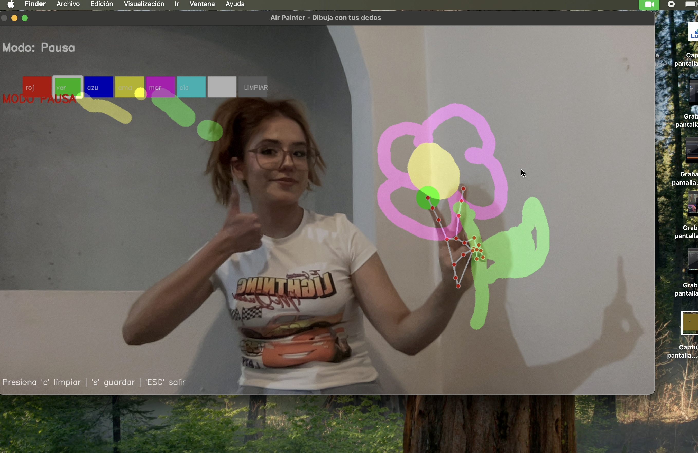
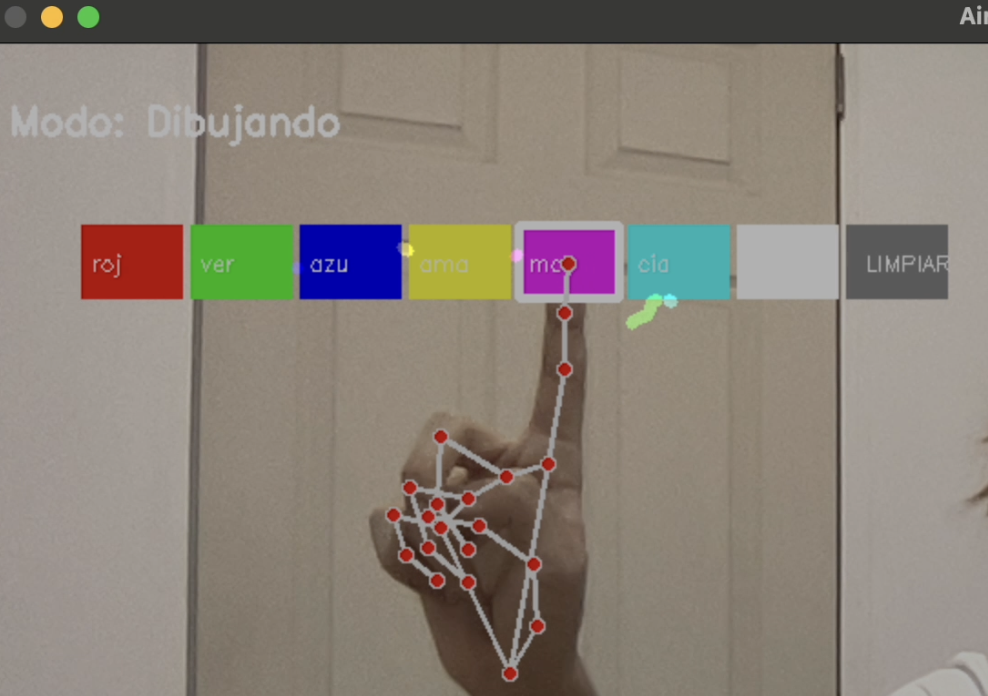
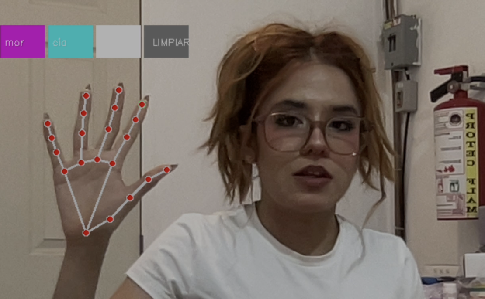
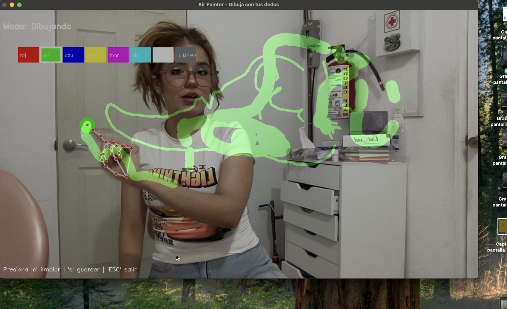

# Air Painter

<p align="center">
  Dibuja en el aire utilizando visión por computadora • MediaPipe • OpenCV • Python
</p>

---

<p align="center">
  
</p>

<p align="center">
 Dibuja con tus dedos • Cambia colores • 🖐️ Detecta gestos • Tiempo real
</p>

---

# Sobre el proyecto

**Air Painter** es un pizarrón virtual desarrollado con **Python**, **OpenCV** y **MediaPipe**, capaz de detectar movimientos de la mano en tiempo real mediante visión por computadora.

El sistema utiliza los **21 landmarks de MediaPipe** para interpretar gestos y convertir el movimiento del dedo índice en trazos sobre un lienzo digital.

Pero no es un simple dibujo virtual... 

- Puedes cambiar colores usando gestos  
- Controlar el tamaño del pincel  
- Pausar el dibujo  
- Limpiar la pantalla  
- Guardar tus dibujos automáticamente 

---

# Tecnologías utilizadas

| Tecnología | Uso |
|---|---|
| Python | Lenguaje principal |
| OpenCV | Procesamiento de video e imágenes |
| MediaPipe | Detección de manos y gestos |
| NumPy | Creación del lienzo digital |

---

# ✋ Gestos disponibles

| Gesto | Acción |
|---|---|
| ☝️ Índice levantado | Dibujar |
| 🖕Solo dedo medio | Cambiar tamaño del pincel |
| ☝️✌️ Índice + medio | Pausar dibujo |
| 👉 Señalar color | Cambiar color |
| 🧹 Señalar "LIMPIAR" | Limpiar lienzo |

---

# Características

- Detección de manos en tiempo real  
- Pizarrón digital interactivo  
- Paleta dinámica de colores  
- Cambio de grosor del pincel  
- Sistema de pausa  
- Guardado de dibujos  
- Efecto espejo  
- Interfaz visual en tiempo real  

---

## 🎨 Paleta dinámica

<p align="center">
  
</p>

---

## ✋ Detección de landmarks

<p align="center">
  
</p>

---

## 🖌️ Dibujando en tiempo real

<p align="center">
  
</p>

---

# ⚙️ Instalación

## 1.- Clonar repositorio

```bash
git clone https://github.com/TU-USUARIO/camara-con-pizarron-dinamico.git
```

## 2.- Entrar al proyecto

```bash
cd camara-con-pizarron-dinamico
```

## 3.- Instalar dependencias

```bash
pip install opencv-python mediapipe numpy
```

---

# ▶️ Ejecutar proyecto

```bash
python main.py
```

---

# Versiones disponibles

## Versión Completa

Incluye:
- Colores
- Gestos
- Tamaño dinámico
- Botón limpiar
- Guardado de imágenes
- Modo pausa

---

## Versión Simple

Versión reducida para comprender fácilmente la lógica principal del proyecto.

---

# 💡 Conceptos aplicados

- Visión por computadora
- Hand Tracking
- Detección de gestos
- Procesamiento de imágenes
- Conversión de coordenadas
- Dibujo dinámico
- Programación en tiempo real
- Programación orientada a objetos

---

# 🔮 Mejoras futuras

- Sonidos interactivos
- Más herramientas de dibujo
- IA para reconocimiento de formas
- Exportar en distintos formatos
- Soporte para ambas manos

---

# 👩‍💻 Autora

Desarrollado por Eve 🌸🌸

Proyecto creado con Python, paciencia y muchas pruebas con la cámara 😭✨

---

# ⭐ Si te gustó el proyecto...

¡No olvides darle una estrella al repositorio!
